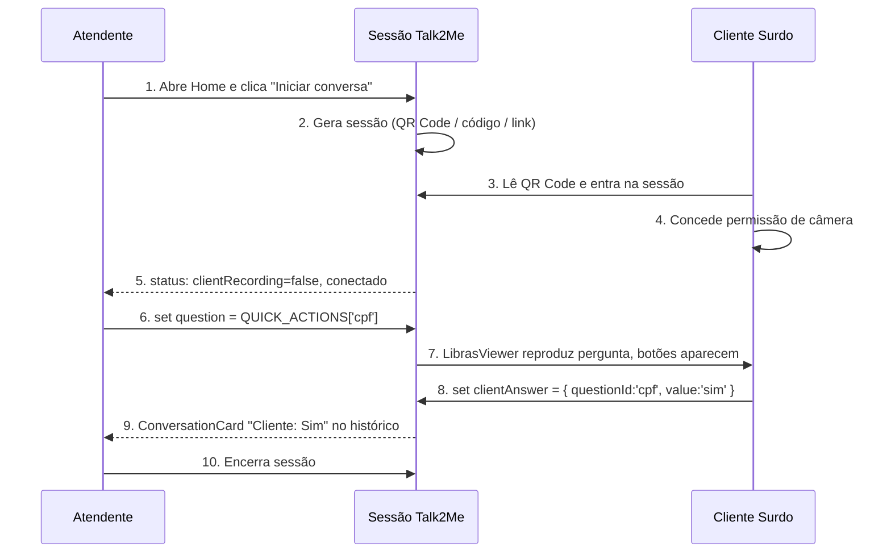

# Funcionamento da Aplicação

> [!abstract] Em uma frase
> O **Talk2Me** atua como uma **ponte de comunicação síncrona entre dois dispositivos** — o do atendente e o do cliente surdo — durante um atendimento de balcão, traduzindo intenções nos dois sentidos via avatar em LIBRAS, perguntas pré-prontas, transcrição em tempo real e reconhecimento de sinais.

> [!info] Referências de frontend
> Todas as decisões visuais aqui derivam do [[Design System]] (DS v1.0, `docs/design-system-bundle/`). Os artboards canônicos das telas estão em `design-system-bundle/project/Talk2Me Screens.html`.

## Visão geral

Aplicação web de acessibilidade voltada ao **atendimento ao público em supermercados** — caixas, balcões de informação e SAC. Remove a barreira de comunicação entre **atendentes ouvintes** (sem fluência em LIBRAS) e **clientes com deficiência auditiva**, sem depender de intérprete humano e sem exigir treinamento prévio da equipe.

## Topologia: dois dispositivos, uma sessão

> [!info] Cada atendimento envolve duas telas
> Ambas conectadas à mesma sessão por um **event bus síncrono** (no protótipo, `window.__T2M_BUS`; no produto, um canal WebSocket/WebRTC).

### Dispositivo do atendente

Computador, notebook ou tablet do lado de dentro do balcão. Exibe a [[Interface do Atendente]]. Layout **desktop/tablet-first**.

### Dispositivo do cliente

Tablet, celular ou totem voltado para o cliente. Exibe a [[Interface do Cliente]]. Layout **mobile-first**, com toque grande.

## Estado compartilhado da sessão

O canal de comunicação carrega esta estrutura (definida em `screens-shared.jsx`):

```ts
{
  question: { id, text, options } | null,        // pergunta enviada pelo atendente
  clientAnswer: { questionId, value } | null,    // resposta escolhida pelo cliente
  history: [{ side, text, time, kind }],         // histórico completo da conversa
  clientRecording: boolean,                       // cliente está gravando LIBRAS
  librasText: string | null,                      // texto reconhecido dos sinais
}
```

Cada mutação propaga em tempo real para os dois lados.

## Fluxo principal de uma sessão



### Detalhamento passo a passo

1. Atendente acessa a [[Home do Sistema]].
2. Clica em **Iniciar conversa** (botão `Btn xxl` brand primary).
3. Sistema gera **sessão** com QR Code, código curto (ex: `T2M-9F4K`) e link.
4. Dispositivo do cliente conecta por uma das três vias.
5. Cliente concede **permissão de câmera** (tela dedicada).
6. Atendente passa a ver:
	- [`Transcription`](docs/design-system-bundle/project/ds-section-product.jsx) — texto convertido da LIBRAS em tempo real.
	- [`ConversationCard`](docs/design-system-bundle/project/ds-section-product.jsx) — histórico de bolhas.
7. Atendente envia uma das 8 perguntas do `QUICK_ACTIONS` (ver tabela em [[Design System#Catálogo de ações rápidas]]).
8. Cliente recebe na tela:
	- [`LibrasViewer`](docs/design-system-bundle/project/ds-section-product.jsx) — avatar 3D reproduzindo o sinal.
	- Legenda textual abaixo.
	- Botões grandes (76–96px) com as opções da pergunta.
9. Cliente responde:
	- Por **botão** (`clientAnswer.value` viaja imediatamente).
	- Ou sinalizando em **LIBRAS** pela câmera (`librasText` chega após processamento).
10. Resposta aparece em texto na tela do atendente, gera `ConversationCard` no histórico.
11. Loop até o atendente encerrar.

## Os dois sentidos da tradução

> [!note] Tradução bidirecional, com pesos diferentes
> O caminho **atendente → cliente** precisa funcionar sempre. O caminho **cliente → atendente** pode degradar graciosamente para botões quando o reconhecimento falhar.

### Atendente → Cliente (avatar em LIBRAS)

- **Entrada:** botão `QUICK_ACTIONS` ou texto livre digitado pelo atendente.
- **Motor:** avatar 3D em LIBRAS (avaliação prevista para usar **VLibras** — ver [[TalkToMe#1 Atendente → cliente surdo avatar em LIBRAS]]).
- **Saída:** sinal renderizado no `LibrasViewer` do cliente + legenda textual.
- **Confiabilidade:** alta — vocabulário fixo, sinal determinístico.

### Cliente → Atendente (reconhecimento de LIBRAS)

- **Entrada:** sinais capturados pela câmera do cliente.
- **Motor:** modelo de visão computacional (vocabulário inicial reduzido ao contexto de supermercado).
- **Saída:** texto no `Transcription` do atendente, com indicador de **confiança** (`PT-BR · 98%`).
- **Confiabilidade:** variável — quando a confiança cair, sugerir resposta por botão.

> [!tip] Falhar com graça
> Se a confiança for baixa, o sistema **não adivinha** — exibe alternativas e oferece o fallback por botão. O `LibrasViewer` mantém o avatar em pose neutra durante incertezas, em vez de animar algo errado.

## Exemplos práticos

> [!example] Exemplo 1 — Pergunta binária
> 1. Atendente clica em `Btn` referenciando `QUICK_ACTIONS['cpf']`.
> 2. Bus: `question = { id:'cpf', text:'CPF na nota?', options:[Sim, Não] }`.
> 3. Cliente vê `LibrasViewer` sinalizando *CPF na nota?* + dois botões 96px **Sim** / **Não**.
> 4. Cliente toca **Sim**.
> 5. Bus: `clientAnswer = { questionId:'cpf', value:'sim' }`.
> 6. Atendente vê `ConversationCard` lado direito: *Cliente · 14:32 · Sim*.

> [!example] Exemplo 2 — Cliente inicia a comunicação
> 1. Cliente toca `StartConversionBtn` (modo gravação).
> 2. Bus: `clientRecording = true`.
> 3. `LibrasViewer` mostra borda pulsante; câmera ativa.
> 4. Cliente sinaliza; sistema processa.
> 5. Bus: `librasText = "Onde fica o açougue?"`.
> 6. Atendente vê texto no `Transcription` + entra no histórico.

> [!example] Exemplo 3 — Baixa confiança
> 1. Reconhecimento retorna `librasText` com 64% de confiança.
> 2. `Transcription` mostra texto + pill `warning` "*Pode ser também…*".
> 3. Atendente confirma usando uma `QUICK_ACTION` pertinente, que reabre canal determinístico.

## Estados de uma sessão

| Estado                     | Atendente vê                                | Cliente vê                                       |
| -------------------------- | ------------------------------------------- | ------------------------------------------------ |
| Sessão criada              | QR Code + status *Aguardando…*              | —                                                |
| Cliente conectando         | Pill brand "Cliente entrando…"              | Tela de permissão de câmera                      |
| Sessão ativa               | Painel completo                             | LibrasViewer + câmera + botões                   |
| Pergunta enviada           | ConversationCard direito                    | Avatar sinalizando + botões                      |
| Resposta recebida          | ConversationCard esquerdo                   | Confirmação visual da escolha                    |
| Reconhecimento processando | "Recebendo LIBRAS…" com PulseDot teal       | Indicador de gravação ativa                      |
| Conexão instável           | `ConnStatus weak` (warning)                 | `ConnStatus weak` (warning)                      |
| Erro de conexão            | `ConnStatus offline` + alerta de reconexão  | Mensagem de reconexão                            |
| Sessão encerrada           | Resumo do atendimento                       | Tela de despedida acessível                      |

## Objetivo da experiência

> [!success] O que um bom atendimento Talk2Me parece
> - Conexão entre dispositivos em **menos de 10s**.
> - Cada interação resolvida em **poucos cliques**.
> - Cliente sai com **autonomia**, sem intérprete.
> - Atendente sai sem ter **aprendido LIBRAS** para servir bem.
> - Nenhum gesto ou pergunta repetido mais de uma vez.

## Princípios que sustentam o fluxo

- **Sessão sincronizada e descartável** — cada atendimento abre/fecha sua própria sessão.
- **Tempo de balcão é precioso** — todo passo extra é desperdício.
- **Interface não pode parecer complexa** — se exige aprendizado, falhou.
- **Tradução com pesos diferentes** — atendente→cliente sempre; cliente→atendente degrada para botões quando precisa.
- **Estados visíveis** — `ConnStatus`, `DeviceIndicator`, PulseDots — o atendente nunca se pergunta *"funcionou?"*.

## Notas relacionadas

- [[TalkToMe]] — MOC do projeto
- [[Design System]] — paleta, tokens, componentes (fonte de verdade do frontend)
- [[Landing Page]] — vitrine institucional
- [[Home do Sistema]] — tela de entrada do atendente
- [[Interface do Atendente]] — painel operacional
- [[Interface do Cliente]] — interface acessível
- `docs/design-system-bundle/project/Talk2Me Screens.html` — protótipo navegável das telas
