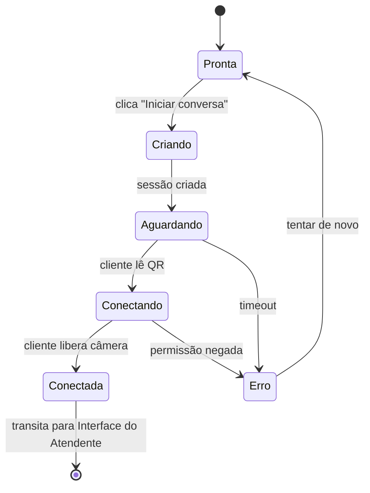

# Home do Sistema

> [!abstract] Em uma frase
> Tela inicial operacional do Talk2Me — **ponto de partida do atendente** para abrir uma sessão acessível com o cliente surdo.

> [!info] Artboard de referência
> `docs/design-system-bundle/project/Talk2Me Screens.html` (seção *Home*, 900px de altura). Componente: `screen-home.jsx`. Todos os tokens visuais vêm do [[Design System]].

## Objetivo

Permitir que o atendente **inicie uma conversa em segundos** entre os dois dispositivos. Tudo o que não serve a essa ação principal é distração.

> [!note] Regra de ouro da Home
> Quem abrir essa tela pela primeira vez, sem treinamento, deve saber o que clicar em **menos de 3 segundos**.

## Elementos principais

### Cabeçalho

- **Wordmark Talk2Me** (`T2MWordmark` height ~32) à esquerda.
- À direita: `DeviceIndicator` para microfone/câmera + atalho `Ajuda rápida` (`Btn ghost`).

### Bloco principal

- **Título:** "Iniciar atendimento acessível" — `font.size.3xl`, peso 600.
- **Descrição:**
  > *Conecte o dispositivo do atendente ao dispositivo do cliente para começar a conversa.*
  `font.size.lg`, cor `text.secondary`.
- **Botão primário XXL:** `Btn xxl primary` — "Iniciar conversa" (88px de altura, brand `#191970`, shadow `0 8px 24px rgba(25,25,112,0.3)`).

### Seletor de tipo de atendimento

Antes ou abaixo do CTA, três opções:

- **Caixa** (ícone `card`)
- **Balcão de informações** (ícone `info`)
- **Atendimento ao cliente** (ícone `users`)

Renderizado como `ModeSelector`-like, com a opção ativa em `surface.default` + shadow, e inativas em transparente.

### Card de status da conexão

Aparece após o clique em **Iniciar conversa**. Mostra em tempo real:

| Item                 | Indicador                                         |
| -------------------- | ------------------------------------------------- |
| Atendente conectado  | `ConnStatus online` (success)                     |
| Cliente              | `aguardando` / `conectado` / `erro`               |
| Câmera               | `DeviceIndicator kind="cam"`                      |
| Microfone            | `DeviceIndicator kind="mic"`                      |
| ID da sessão         | Pill mono — ex: `T2M-9F4K`                        |
| QR Code              | Grande, com margem de quietude generosa           |
| Link da sessão       | Input read-only + botão copiar                    |

### Ações de apoio

- `Btn outline lg` **Testar câmera e microfone** — abre diagnóstico rápido.
- `Btn ghost` **Como funciona** — overlay com demo de 30s.
- `Btn ghost` **Ajuda**.

## Comportamento

No protótipo, a transição **Aguardando → Conectada** acontece automaticamente em ~3 segundos para demonstração. No produto real, depende da conexão real do cliente.

## Estados de uso

| Estado                          | O que aparece                                                |
| ------------------------------- | ------------------------------------------------------------ |
| Inicial                         | CTA primary XXL em destaque                                  |
| Criando sessão                  | `Btn loading` + texto *"Criando sessão…"*                    |
| Aguardando cliente              | QR Code grande + código + link + status *"Aguardando cliente"* |
| Cliente conectando              | Indicador animado *"Cliente entrando…"*                      |
| **Sucesso** (ambos conectados)  | Pill `success` + transição automática para [[Interface do Atendente]] |
| Permissão negada (cliente)      | Aviso ao atendente + instrução para guiar o cliente          |
| Erro de conexão                 | `ConnStatus offline` + `Btn outline` *"Tentar novamente"*    |
| Sessão expirada                 | Mensagem + `Btn primary` *"Criar nova sessão"*               |

## Estados especificados no briefing original

O briefing pedia três variações explícitas — todas implementadas no protótipo:

1. **Estado vazio** — nenhum dispositivo conectado: CTA em destaque, sem card de status.
2. **Estado de sucesso** — ambos conectados: indicadores success, transição automática.
3. **Estado de erro** — falha de conexão: banner error, CTA *"Tentar novamente"*.

## Exemplo prático

> [!example] Cliente surdo chega ao caixa
> 1. Atendente seleciona **Caixa** no seletor.
> 2. Clica em **Iniciar conversa**.
> 3. QR Code aparece em ~1s.
> 4. Atendente vira o tablet do cliente; cliente escaneia com o celular **ou** usa o tablet.
> 5. Cliente libera câmera.
> 6. Em ~6s, a Home some e a [[Interface do Atendente]] aparece.

## Componentes do DS aplicados

| Onde                       | Componente                                       |
| -------------------------- | ------------------------------------------------ |
| Logo                       | `T2MWordmark`                                    |
| CTA principal              | `Btn xxl primary` (88px)                         |
| Botões secundários         | `Btn outline lg` · `Btn ghost`                   |
| Seletor de tipo            | Variação de `ModeSelector`                       |
| Card de status             | `Card` + `ConnStatus` + `DeviceIndicator`        |
| ID da sessão               | `Pill` mono                                      |
| QR Code                    | Ícone `qr` + grid SVG                            |
| Tipografia                 | Heading Lexend 600 + Atkinson Hyperlegible body  |

## Sugestões de melhorias para a Home

> [!tip] Iterações que aumentam robustez sem comprometer simplicidade

1. **Auto-reabertura de sessão** — se o atendente fechou a aba sem querer, restaurar a última sessão ativa.
2. **Modo "balcão fixo"** — QR Code permanente para o balcão; cada cliente escaneia para entrar em uma sessão imediata.
3. **Pré-aquecimento do avatar** — carregar recursos do `LibrasViewer` em segundo plano enquanto o atendente decide iniciar.
4. **Onboarding contextual** — no primeiro uso, destacar o CTA com seta animada que some após o primeiro clique.
5. **Tempo médio de conexão** visível — *"normalmente leva 5 segundos"* tranquiliza o atendente novato.
6. **Atalho de teclado** — `Espaço` ou `Enter` dispara o CTA (útil em PDVs com teclado físico).
7. **Histórico do dia discreto** — *"Você atendeu 7 clientes hoje"*, sem virar tela cheia.
8. **Detecção automática de problema** — se câmera/microfone falharem, sugerir teste antes do cliente chegar.
9. **Modo escuro automático** — útil em totens 24h. Aproveitar `background.inverse` (`#0A0A2D`) do DS.
10. **Pareamento por NFC** opcional em tablets fixos no balcão.

## Tom da tela

Simples, direto, **focado em uma única ação**. A Home não educa, não convence — ela **abre a porta**.

## Notas relacionadas

- [[TalkToMe]] — MOC do projeto
- [[Design System]] — tokens e componentes (fonte de verdade)
- [[Funcionamento da Aplicação]] — fluxo completo de uma sessão
- [[Interface do Atendente]] — tela que recebe o atendente após a conexão
- [[Interface do Cliente]] — onde o cliente entra após o QR Code
- Artboard: `docs/design-system-bundle/project/screen-home.jsx`
