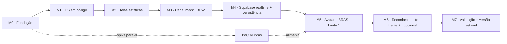
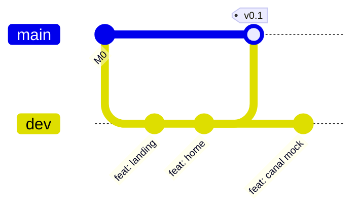

# Plano de Desenvolvimento

> [!abstract] Em uma frase
> Roadmap de engenharia do **Talk2Me** — organizado em **marcos relativos (M0→M7)**, com decisões técnicas fechadas, fronteiras de módulo que evitam colisão entre os dois desenvolvedores assíncronos e um *checkpoint de saída* objetivo por marco.

> [!info] Como ler este plano
> - **Marcos são relativos**, não têm data. Cada um só começa quando o *checkpoint de saída* do anterior está fechado (salvo onde indicado como paralelizável).
> - Cada marco traz **entregáveis**, **checkpoint de saída (DoD)**, **dependências** e uma **sugestão de divisão** entre os dois devs.
> - Toda decisão visual consulta antes o [[Design System]]; todo fluxo consulta o [[Funcionamento da Aplicação]].

## 1. Princípios do plano

Coerentes com o que o produto exige (ver [[TalkToMe]]):

1. **Frente 1 primeiro.** Avatar em LIBRAS + frases prontas precisam funcionar. Reconhecimento de gestos (frente 2) é *bônus* e fica para o fim.
2. **Computação gráfica isolada e tardia.** A parte de visão computacional (reconhecimento) entra só no final, depois das telas e do fluxo estarem sólidos — é a área de maior risco e pesquisa.
3. **100% free tier.** Nada de custo: SPA em host estático gratuito + Supabase free (Realtime, Postgres).
   - **Sem login/cadastro.** O atendente entra direto; o cliente entra na sessão por QR/código/link. Não há autenticação nesta versão.
   - **Histórico vive no navegador.** As conversas ficam na sessão do navegador (estado em memória + `sessionStorage`), não em banco — descartadas ao fechar a aba.
4. **Telas antes de backend real.** As telas avançam contra um **canal mockado**; o WebSocket real (Supabase Realtime) entra atrás da **mesma interface**, sem reescrever tela.
5. **Acessibilidade não é etapa, é critério.** WCAG 2.2 AA faz parte do *Definição de Pronto* de toda tela.
6. **Commits pequenos e frequentes na `dev`.** Cada mudança fechada vira commit. `main` só recebe versões estáveis.

## 2. Decisões técnicas fechadas

| Camada          | Decisão                                                                               | Observação                                                                                                    |
| --------------- | ------------------------------------------------------------------------------------- | ------------------------------------------------------------------------------------------------------------- |
| Linguagem/Build | **React + Vite + TypeScript**                                                         | TS dá contrato tipado da sessão (ponto de encontro entre os 2 devs e as 2 telas).                             |
| Estilo          | **Tailwind** com tema custom dos tokens do DS                                         | Tokens do [[Design System]] viram `theme.extend` + CSS variables `--t2m-*`.                                   |
| Fontes          | **Lexend** (headings) · **Atkinson Hyperlegible** (corpo) · **IBM Plex Mono** (dados) | Via Google Fonts. Ver [[Design System#Tipografia · escolha final]].                                           |
| Canal de sessão | **Supabase Realtime** atrás da interface `SessionChannel`                             | WS gerenciado, free tier. Implementações `MockChannel` e `SupabaseChannel`.                                   |
| Histórico       | **Sessão do navegador** (estado em memória + `sessionStorage`)                        | Conversas não são persistidas em banco; descartadas ao fechar a aba. Sem login/cadastro nesta versão.         |
| Persistência    | **Supabase Postgres** (mínima)                                                        | Apenas formulário de demonstração da Landing. `QUICK_ACTIONS` é config estática (`session/QUICK_ACTIONS.ts`). |
| Avatar LIBRAS   | **VLibras (PoC)** com plano B                                                         | PoC obrigatória antes de virar dependência — ver [[TalkToMe#1 Atendente → cliente surdo avatar em LIBRAS]].   |
| Reconhecimento  | **MediaPipe Tasks / TensorFlow.js** (a confirmar na pesquisa)                         | Frente 2, opcional, último marco.                                                                             |
| Hospedagem      | Host estático **free** (Vercel / Netlify / Cloudflare Pages)                          | SPA client-side; deploy contínuo a partir da `dev` (preview) e `main` (produção).                             |

> [!warning] Regra de ouro do acoplamento
> Nenhuma tela importa `supabase` diretamente. Telas falam **só** com `SessionChannel`. Trocar `MockChannel` por `SupabaseChannel` deve ser **uma linha** no provider.

## 3. Arquitetura de alto nível

### Contrato da sessão (fonte da verdade tipada)

Deriva do estado compartilhado descrito em [[Funcionamento da Aplicação#Estado compartilhado da sessão]]:

```ts
// src/session/types.ts
export interface Option { value: string; label: string; icon?: string }

export interface SessionState {
  question: { id: string; text: string; options: Option[] } | null;
  clientAnswer: { questionId: string; value: string } | null;
  history: { side: 'attendant' | 'client'; text: string; time: string; kind: string }[];
  clientRecording: boolean;
  librasText: string | null;
}

// O bus do protótipo (window.__T2M_BUS) vira esta interface:
export interface SessionChannel {
  send(patch: Partial<SessionState>): void;
  subscribe(cb: (state: SessionState) => void): () => void;
  close(): void;
}
```

### Estrutura de pastas proposta

Pensada para que cada dev trabalhe em uma **feature isolada** com pouca sobreposição de arquivos:

```
src/
  app/            # bootstrap, rotas, providers (SessionChannelProvider)
  ds/             # Design System em código (congelado após M1)
    tokens/       # cores, spacing, radius, shadow, motion
    components/   # Btn, Input, Card, Pill, Toast, Modal...
  features/
    landing/      # Landing Page
    home/         # Home do Sistema
    attendant/    # Interface do Atendente
    client/       # Interface do Cliente
  session/        # types, SessionChannel, MockChannel, SupabaseChannel, QUICK_ACTIONS
  lib/            # cliente supabase, utils, hooks genéricos
  assets/
```

### Cadeia de dependência dos marcos



## 4. Fluxo de trabalho dos dois devs

### Branches

- **`dev`** — branch de trabalho. **Todo commit vai aqui.** Deploy de *preview* automático.
- **`main`** — só **versões estáveis**. Recebe `dev` via merge quando o time decide "subir versão". Cada merge em `main` ganha uma **tag** (`v0.1`, `v0.2`…).



### Convenção de commit

Seguindo o que já existe no repo (`docs:`, `chore:`):

```
<tipo>(<escopo>): <descrição no imperativo>
# tipos: feat, fix, docs, chore, refactor, style, test
# escopo: landing | home | attendant | client | ds | session | infra
```

Exemplo: `feat(client): adiciona LibrasViewer com legenda e botão repetir`

### Evitando colisão (o ponto crítico do trabalho assíncrono)

> [!important] Três regras simples
> 1. **Antes de começar, `git pull` na `dev`** e marque no *Quadro de Alocação* (§6) qual módulo você está pegando.
> 2. **Um módulo (pasta de feature) tem um dono por vez.** Os módulos foram desenhados para não se cruzarem — `landing/` nunca toca `client/`.
> 3. **`ds/` e `session/types.ts` são áreas compartilhadas e congeladas.** Mudança nelas exige aviso no quadro **antes** + commit isolado e pequeno (os dois dependem desses arquivos).

> [!tip] Por que isso funciona
> A partir do M2, o trabalho é dividido por **tela** (vertical slice). Duas telas diferentes = dois conjuntos de arquivos diferentes = quase zero conflito de merge. As únicas zonas de atrito (DS e contrato da sessão) são construídas **cedo e congeladas**.

### Definição de Pronto (DoD) — vale para toda entrega

- [ ] Fiel ao [[Design System]] (tokens, espaçamento, estados).
- [ ] Acessível: foco visível, contraste AA, toque ≥44px, ícone sempre com texto, `prefers-reduced-motion` respeitado.
- [ ] Responsivo no alvo da tela (atendente: desktop/tablet; cliente: mobile-first).
- [ ] Sem `console.error`/warnings; lint e type-check passando.
- [ ] Commitado na `dev` com mensagem na convenção.
- [ ] *Quadro de Alocação* atualizado (módulo liberado).

## 5. Marcos (M0 → M7)

### M0 · Fundação do projeto

> [!note] Marco compartilhado — feito por **um dev** (ou em par), depois congelado.

- **Objetivo:** repositório pronto para os dois devs trabalharem sem reconfigurar nada.
- **Entregáveis:**
  - Scaffold Vite + React + TS rodando.
  - Tailwind configurado com **tokens do DS** (cores, spacing, radius, shadow, motion) + CSS variables `--t2m-*`.
  - Fontes (Lexend / Atkinson Hyperlegible / IBM Plex Mono) carregadas.
  - ESLint + Prettier + script de type-check.
  - Estrutura de pastas (§3) criada com placeholders.
  - Branches `dev` e `main`; deploy free configurado (preview da `dev`).
- **Checkpoint de saída:** `npm run dev` sobe a SPA; uma tela de teste consome os tokens do DS; push na `dev` gera preview online.
- **Dependências:** nenhuma.
- **Divisão:** **um dev** assume sozinho (config compartilhada não se divide bem). O outro pode iniciar a **spike da PoC do VLibras** em paralelo (§7).

### M1 · Design System em código

- **Objetivo:** traduzir o [[Design System]] em componentes reutilizáveis — o vocabulário comum das telas.
- **Entregáveis:**
  - **Core:** `Btn` (variantes×tamanhos×estados), `Input`/`Select`/`Textarea`, `Card`, `Pill`, `Toast`, `Modal`, `Alert`, estados de loading/empty.
  - **Produto:** cascas de `LibrasViewer`, `Transcription`, `ConversationCard`, `ConnStatus`, `DeviceIndicator`, `StartConversionBtn`, `ModeSelector` (sem lógica de sessão ainda).
  - `session/QUICK_ACTIONS.ts` (catálogo canônico das 8 perguntas — ver [[Design System#Catálogo de ações rápidas]]).
- **Checkpoint de saída:** todos os componentes renderizam em uma página de showcase, fiéis ao DS, e ficam **congelados** (mudança exige aviso no quadro).
- **Dependências:** M0.
- **Divisão:** **Dev A** = componentes *core*; **Dev B** = componentes *de produto* + `QUICK_ACTIONS`. Pouca sobreposição.

### M2 · Telas estáticas (sem sincronização)

- **Objetivo:** as quatro telas, fiéis ao DS, navegáveis, com estado local/mock — **sem** canal real ainda.
- **Entregáveis:**
  - [[Landing Page]] — hero, como funciona, benefícios, demonstração, CTA, footer.
  - [[Home do Sistema]] — CTA iniciar, seletor de tipo, card de status (mockado), QR/código/link.
  - [[Interface do Atendente]] — transcrição (mock), histórico, grid de ações rápidas, texto livre.
  - [[Interface do Cliente]] — `LibrasViewer` (placeholder), botões de resposta condicionais, câmera (preview), `StartConversionBtn`.
- **Checkpoint de saída:** as 4 telas navegáveis, pixel-fiéis ao DS, responsivas e com a11y básica; cada tela passa o DoD.
- **Dependências:** M1.
- **Divisão (vertical slice, baixa colisão):** **Dev A** = `landing/` + `home/`; **Dev B** = `attendant/` + `client/`.

### M3 · Canal de sessão (mock) + fluxo entre telas

- **Objetivo:** ligar atendente ↔ cliente localmente, validando todo o fluxo do [[Funcionamento da Aplicação]] sem backend.
- **Entregáveis:**
  - `SessionChannel` + `MockChannel` (BroadcastChannel entre abas / memória).
  - `SessionChannelProvider` no `app/`.
  - Fluxo completo por **botões**: `question` → `clientAnswer` → `history`; `clientRecording`; estados de conexão/sessão.
- **Checkpoint de saída:** em duas abas, atendente envia uma `QUICK_ACTION`, cliente responde no botão, resposta aparece no histórico do atendente — **em tempo real**.
- **Dependências:** M2.
- **Divisão:** **Dev A** = interface + `MockChannel` + provider; **Dev B** = fiação das telas ao canal. Sincronizar no contrato (`session/types.ts`).

### M4 · Supabase: realtime + sessão entre dispositivos

- **Objetivo:** trocar o mock por **WebSocket real** e conectar dois dispositivos de verdade.
- **Entregáveis:**
  - Projeto Supabase (free tier); schema mínimo (`demo_requests` da Landing). Sessões são efêmeras no canal Realtime; **histórico permanece no navegador** (sem login, sem persistência em banco).
  - `SupabaseChannel` (Realtime broadcast/presence) implementando `SessionChannel`.
  - Criação de sessão real: QR Code + código curto + link; cliente entra por uma das três vias (sessão anônima, sem cadastro).
  - Formulário da Landing gravando em `demo_requests`.
- **Checkpoint de saída:** dois dispositivos reais (celular + notebook) conectam em **<10s** e trocam estado em tempo real; trocar `Mock`→`Supabase` foi **uma linha** no provider.
- **Dependências:** M3.
- **Divisão:** **Dev A** = schema mínimo + `SupabaseChannel`; **Dev B** = UI de criação/entrada de sessão (QR/código/link) + formulário da Landing.

### M5 · Avatar 3D em LIBRAS (frente 1 — parte gráfica)

> [!note] Primeira computação gráfica do projeto — ainda na frente prioritária.

- **Objetivo:** o avatar reproduz as mensagens do atendente em LIBRAS no `LibrasViewer`.
- **Entregáveis:**
  - Conclusão da **PoC do VLibras** no vocabulário de supermercado (decisão *go/no-go*, ver §7).
  - Integração do motor escolhido no `LibrasViewer` (VLibras **ou** plano B: vídeos pré-renderizados / animações próprias para o vocabulário fixo).
  - Legenda textual sincronizada; pose neutra em incerteza; botão *Repetir*.
- **Checkpoint de saída:** as 8 `QUICK_ACTIONS` + texto livre são sinalizadas com qualidade aceitável **ou** o plano B está implementado e documentado com `> [!warning] Desvio do DS` na nota da tela.
- **Dependências:** M4 (idealmente PoC já concluída em paralelo desde M0).
- **Divisão:** **Dev A** = integração do motor/avatar; **Dev B** = camada de legenda, estados (sinalizando/neutro/repetir) e fallback.

### M6 · Reconhecimento de LIBRAS (frente 2 — opcional)

> [!warning] Maior risco e maior pesquisa — explicitamente opcional.
> Se não atingir robustez mínima, o produto **continua válido pela frente 1**. Documentar a inviabilidade também é resultado de TCC.

- **Objetivo:** cliente sinaliza pela câmera; sistema reconhece um vocabulário reduzido e exibe texto ao atendente.
- **Entregáveis:**
  - Pesquisa e escolha da lib (MediaPipe Hand Landmarker / Gesture Recognizer, TensorFlow.js) — ver [[Reconhecimento de LIBRAS]] e [[Dataset]].
  - Pipeline em tempo real: captura → inferência → `librasText` + **confiança**.
  - **Falha graciosa:** baixa confiança nunca adivinha — cai para botões/repetir (ver [[Funcionamento da Aplicação#Os dois sentidos da tradução]]).
- **Checkpoint de saída:** reconhece o vocabulário reduzido com fallback gracioso **ou** registra, com evidências, a inviabilidade no contexto.
- **Dependências:** M5.
- **Divisão:** **Dev A** = pipeline de visão/inferência; **Dev B** = UI de gravação, indicador de confiança e fallback.

### M7 · Validação, polimento e versão estável

- **Objetivo:** fechar a versão apresentável e gerar evidências para o artigo.
- **Entregáveis:**
  - Auditoria WCAG 2.2 AA; revisão de performance; *dark mode* (aproveitar `background.inverse`).
  - Teste de campo / usabilidade com usuários (idealmente pessoas surdas) — ver [[Validação]].
  - Versão estável: merge `dev` → `main` + **tag**; resultados consolidados no [[ModeloArtigo V2.docx]].
- **Checkpoint de saída:** tag de versão estável em `main`, métricas e feedback coletados, artigo atualizado.
- **Dependências:** M5 (M6 se concluído).
- **Divisão:** **par** — auditoria e validação se beneficiam de duas pessoas.

## 6. Quadro de Alocação (atualizar a cada início/fim de trabalho)

> [!info] Este quadro é o "lock" leve do projeto
> Antes de mexer num módulo, marque seu nome e `🔒 em andamento`. Ao terminar e commitar, marque `✅ livre`. Quem for pegar trabalho consulta aqui primeiro.

| Módulo / área | Dono atual | Status | Marco |
| ------------- | ---------- | ------ | ----- |
| `infra` (config, tokens, deploy) | — | ✅ livre | M0 |
| `ds/` (congelado após M1) | — | ✅ livre | M1 |
| `session/` (contrato — congelado) | — | ✅ livre | M1/M3 |
| `features/landing/` | — | ✅ livre | M2 |
| `features/home/` | — | ✅ livre | M2 |
| `features/attendant/` | — | ✅ livre | M2 |
| `features/client/` | — | ✅ livre | M2 |
| PoC VLibras (spike) | — | ✅ livre | paralelo |

## 7. Spike paralela: PoC do VLibras

> [!tip] Pode (e deve) começar cedo — em paralelo ao M0
> O VLibras é o **maior risco da frente 1**. Quanto antes a PoC rodar, mais cedo sabemos se vale a pena ou se acionamos o plano B.

- **Pergunta a responder:** o VLibras sinaliza as 8 `QUICK_ACTIONS` e frases livres curtas do contexto de supermercado com **fidelidade e desempenho aceitáveis** no navegador do balcão?
- **Saída:** decisão *go/no-go* documentada em [[Avatar 3D em LIBRAS]]. Se *no-go*, plano B (vídeos pré-renderizados com intérprete / animações próprias) entra no M5.
- **Não bloqueia** M1–M4 (o `LibrasViewer` usa placeholder até o M5).

## 8. Notas relacionadas

- [[TalkToMe]] — MOC do projeto
- [[Funcionamento da Aplicação]] — fluxo e estado da sessão
- [[Design System]] — tokens e componentes (fonte de verdade do frontend)
- [[Landing Page]] · [[Home do Sistema]] · [[Interface do Atendente]] · [[Interface do Cliente]]
- [[Avatar 3D em LIBRAS]] · [[Reconhecimento de LIBRAS]] · [[Dataset]] · [[Validação]]
